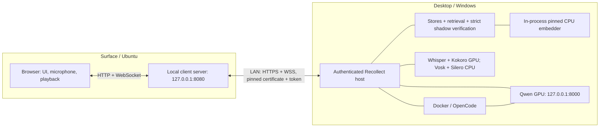

# Deployment configurations

Recollect has three process roles. The existing single-computer setup stays
the default; the split setup adds a Windows desktop host and a lightweight
Ubuntu client for the Surface.

| Role | UI and audio devices | Memory and models |
|---|---|---|
| `standalone` | Browser on the desktop | Desktop owns the entire backend |
| `host` | UI is served by the client | Desktop owns the entire backend |
| `client` | Surface browser; local UI server forwards requests | No local model runtime or conversation store |

After one-time command setup, launch with:

| Computer | Command | Configuration |
|---|---|---|
| Windows desktop | `recollect` | Complete standalone application |
| Windows desktop | `recollect-host` | Desktop backend and models for the Surface |
| Ubuntu Surface | `recollect-deploy` | UI and audio client connected to the saved desktop |



The network boundary is the **application API**. A client sends messages and
audio; the host returns transcripts, replies, speech, and verified traces.
There is no HTTP embedding endpoint. Memory stores and the embedder stay in
the same desktop process, preserving [the research identity](EMBEDDER.md).
The sibling `episodic` repository is required only on the desktop and is
consumed unchanged. Qwen keeps its existing single slot and loopback address;
clients do not contact it or the research container directly.

## Network and first-time pairing

`localhost` refers to the computer making the request. The Surface browser
opens `http://127.0.0.1:8080`, and its local proxy reaches the desktop by a
LAN IP address or hostname, such as `https://desktop-name:8080`. Reserve a stable
desktop address in your router or use a hostname both machines can resolve.

Host mode requires a shared token for every HTTP and WebSocket route and uses
TLS for network connections. The Windows launcher creates a private pairing
bundle at `var/deployment-token.txt` on its first host launch, unless
`recollect-host --token-file` selects another path. Despite the retained filename,
this is JSON containing the token and the desktop's public certificate. Copy
this one file through a trusted transfer method to the Surface, for example to
`~/.config/recollect/desktop-token`. Ubuntu setup and each launch enforce owner-only
access automatically. Linked files/directories and files owned by another user
are rejected.

The desktop's adjacent `.tls.key` file stays on the desktop; do not copy it.
The client trusts the certificate in its copied bundle and verifies the fixed
TLS identity `recollect-desktop`, independently of the LAN IP/hostname used for
routing. Certificate verification is enabled for both HTTPS and WSS; no system
certificate installation or browser exception is needed. The browser continues
using its local HTTP address.

The token belongs in that private file, not in browser assets, a URL, or a
tracked `.env` file. The proxy attaches it after validating the browser's local
origin. A wrong certificate or token prevents client startup. The launcher
upgrades an existing plain token file into a secure bundle while preserving its
token; copy the upgraded bundle to the Surface once. Existing saved `http://`
desktop addresses automatically use HTTPS when loaded with the secure bundle.
If pairing material is replaced, update both machines and restart Recollect.

Permit inbound TCP on the chosen Recollect port on the desktop's private
network, preferably scoped to the Surface address. Do not expose Qwen's 8000
port. The launchers do not change firewall rules or router port forwarding.
Plain HTTP to a LAN desktop is rejected. A legacy token remains usable with
conventionally trusted HTTPS, or with an explicitly configured loopback tunnel
using `--allow-http-loopback`. That opt-in permits only a loopback desktop URL;
the encrypted tunnel itself must already be configured.

Keeping the browser URL on Surface loopback also preserves the secure context
required for microphone access. Opening an ordinary HTTP desktop LAN address
directly in the browser does not provide that property.

## Launch commands

### One-time Windows command setup

From the repository root in PowerShell:

```powershell
.\scripts\install-commands.ps1
```

This installs `recollect` and `recollect-host` in your user command directory
and adds it to your user PATH if necessary. It does not start services or
reinstall the pinned environment. Open a new terminal if its PATH was already
loaded before installation. The commands work from any directory and use this
checkout's existing `.venv`, `.env`, and launch sequence. Re-run setup if the
checkout moves.

### Existing standalone desktop

In PowerShell, using the saved `.env`, model assets, and binary-pinned `.venv`
described in [AGENTS.md](../AGENTS.md):

```powershell
recollect
```

This brings up Docker, the single GPU Qwen server, Recollect and warmed GPU
voice. It builds a missing or stale UI and verifies readiness. The browser
opens `http://127.0.0.1:8080`. Services remain running after the launcher exits.

### Desktop host

```powershell
recollect-host
```

Host mode binds HTTPS Recollect to `0.0.0.0:8080` by default. To select a specific
desktop LAN interface, pass `--host` with that interface's actual IP address.
The existing `.env` model settings remain in use. The launcher checks Docker,
Qwen, the pinned embedder, Whisper CUDA float16, and Kokoro's CUDA provider.
It prints process IDs and runtime log locations, never the pairing token.
Host mode serves the backend without the inspector UI.

### Surface client on Ubuntu

Clone or copy this Recollect repository to the Surface. It needs `uv` and a
browser. A UI build also needs Node.js/npm; neither Docker nor the sibling
research repository nor any model/CUDA packages are needed on the Surface.
After copying the desktop pairing bundle, run this setup once from the
repository root, using the actual desktop hostname or IP:

```bash
bash scripts/install-client-command.sh \
  --desktop-url https://desktop-name:8080 \
  --token-file ~/.config/recollect/desktop-token
```

Setup saves the desktop address and absolute token-file location privately
under your user configuration directory. It installs `recollect-deploy` in
`~/.local/bin`. If that directory is not yet on PATH, follow the installer's
one-time PATH instruction or sign out and back in on Ubuntu. Setup does not
start the client or install models. Then launch from any directory with:

```bash
recollect-deploy
```

The saved settings eliminate repeated flags. Re-run setup to change the
desktop address or token-file location. Ordinary launches read the current
token file, so replacing its contents does not require repeating setup.

The launcher builds a missing or stale UI. `uv` provisions Python 3.13 and an
isolated environment from the lightweight script metadata and transitive lock in
[`deploy/client.py`](../deploy/client.py) and
[`deploy/client.py.lock`](../deploy/client.py.lock), without syncing the desktop project.
The first launch may download those dependencies. The client verifies the
paired host before serving. Open `http://127.0.0.1:8080` on the Surface and enable
voice there. Ctrl+C stops the local client; the desktop remains running.

Do **not** run the repository-root `uv sync` to install the Surface client:
that is the desktop installation path and intentionally includes the research
and model dependencies. No performance claim is made for local models on the
Surface's stated GTX 1050 / 2 GB VRAM and 16 GB RAM.

### Application-only commands

The existing `recollect doctor`, `recollect chat`, and `recollect serve`
subcommands remain available. When Docker and Qwen are already managed
separately, the CLI can select a role without launching those services:

```powershell
uv run --no-sync recollect serve --mode standalone
uv run --no-sync recollect serve --mode host --host 0.0.0.0 --token-file var/deployment-token.txt
```

These `serve` commands start only Recollect; use the PowerShell launcher for
full desktop readiness and voice warm-up. Do not launch a second Recollect on
an occupied port. Stop the existing verified application before switching
between standalone and host roles; both roles use the same saved history.

The original `scripts/launch.ps1 -Mode standalone|host` and
`bash scripts/launch-client.sh --desktop-url ... --token-file ...` forms remain
available for scripts and troubleshooting.

## Settings

Explicit `serve` arguments override loaded environment values. A selected
`--env-file` is loaded without replacing existing shell variables, matching
the existing `.env` behavior. Keep private client settings in an ignored
location such as `var/client.env` or outside the repository.

| Environment setting | Use |
|---|---|
| `RECOLLECT_DEPLOYMENT_MODE` | `standalone` (default), `host`, or `client` |
| `RECOLLECT_HOST` / `RECOLLECT_PORT` | Local bind address and port; standalone and client require loopback |
| `RECOLLECT_DESKTOP_URL` | Client's fixed desktop HTTPS origin; no path, credentials, or query |
| `RECOLLECT_DEPLOYMENT_TOKEN` | Pairing secret, at least 32 printable ASCII characters without spaces |
| `RECOLLECT_TRUSTED_CERTIFICATE_PEM` | Client certificate trust, normally loaded automatically from the pairing bundle |
| `RECOLLECT_SSL_CERTFILE` / `RECOLLECT_SSL_KEYFILE` | Host TLS files, normally managed by the Windows launcher |
| `RECOLLECT_ALLOW_HTTP_LOOPBACK` | Explicit opt-in for a preconfigured loopback tunnel with a legacy token |
| `RECOLLECT_UI_DIR` | Client's built UI directory; defaults to `ui/dist` |

`--token-file` reads the token and certificate into the serving process environment. The
client retains same-origin `/api/*` and `/v1/*` requests, streaming SSE chat,
NDJSON/WAV speech and the binary/text voice WebSocket. It does not retry chat
POSTs. Disconnects close the upstream stream so the existing backend can
cancel work and release its locks. Only one voice listener can be active on
the desktop at once, as in standalone mode.

Standalone and client HTTP/WebSocket requests must use a loopback Host and a
matching browser Origin. Standalone also permits the existing localhost Vite
development origins on port 5173. Ordinary local CLI/API clients without an
Origin remain supported. These checks protect against foreign websites; other
programs running on the trusted device retain local API access.

Uploads are limited to 2 MiB with a 30-second upload timeout; chat messages to
1,048,576 characters, titles to 512, and session/turn identifiers to 128 safe
ASCII characters. Each process admits at most 64 concurrent HTTP requests and
8 WebSockets, while voice still permits one active listener. Overload returns
429 or closes excess sockets. Reply streaming, voice frames, timing, and saved
history continue through their existing paths. See
[the hardening record](SECURITY_HARDENING_2026-09-08.md) for coverage and limits.

## Transcription placement

The initial split keeps Whisper on the desktop. The browser streams 16 kHz
mono PCM16 audio in 50 ms frames: 32,000 bytes/second, or 256 kbit/second before
transport overhead. While listening, wake recognition and VAD also execute
on the desktop. Current live drafts, wake-once conversation mode, interruption
handling, the 1.4-second end pause, and the 120-second capture limit are retained.

Surface-local transcription is an open follow-up choice, not a supported
mode flag yet. It would require separating the local listen/wake/VAD service
from remote synthesis, then measuring latency, transcription errors and memory
on the actual Ubuntu device. Sending only completed voice clips would also
require relocating wake detection and interruption control to preserve the
current interaction. Desktop evaluation results do not establish Surface or
LAN performance; see [VOICE.md](VOICE.md) and [WHISPER_EVALUATION.md](WHISPER_EVALUATION.md).

## Validation boundary

Automated deployment tests use fake upstream services and never load models.
They cover role selection, lightweight client imports, host authentication,
certificate verification, HTTP/audio streaming, origin checks, WebSocket controls
and disconnect cleanup. TLS tests use temporary certificates and loopback stub
servers; they do not establish readiness on the actual Surface.
The Windows and Bash launchers can be checked without starting services.
Actual two-machine readiness still requires running the desktop launcher and
the Ubuntu client on the Surface, with its microphone and speakers.
