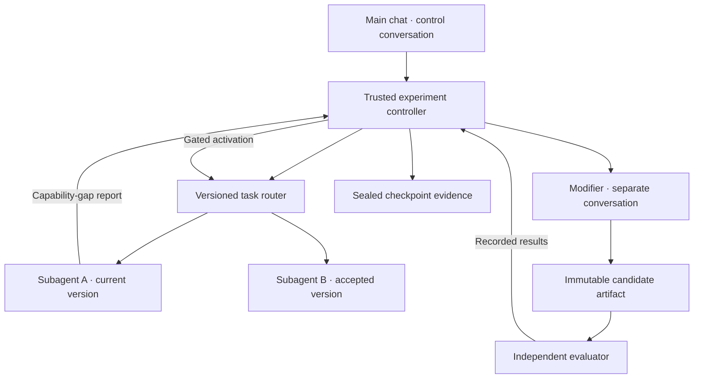

# Self-modification harness: verbatim planning conversation

Source: local thread `01a096b0-8f50-78a1-b469-34fa49fa256b`.

Verbatim user and assistant message text, including commentary, from architecture planning through the capture/implementation instruction. Tool calls, tool outputs, internal reasoning, and environment/instruction messages are excluded.

The JSON companion preserves exact message text and per-message SHA-256 values. Headings and separators below are editorial framing, not part of the messages. This capture is not a replacement or amendment of the registered experiment protocols.

## 1. user

Great. Before we begin implementing the harness, lets agree on its architecture

---

## 2. assistant (commentary)

I’ll ground the proposal in the preregistered checkpoints and existing runtime, then separate the trusted harness from the subagent code that can modify itself. No implementation yet.

---

## 3. assistant (commentary)

The key distinction is between three concurrent conversation lanes and four runtime roles: A and B are deployment versions, while the modifier gets its own lane. I’m using the visualization skill to make those boundaries clear.

---

## 4. assistant (final_answer)

My recommendation is a **trusted, deterministic experiment controller outside the modifiable subagent**, with three independent inference lanes and versioned A/B worker environments.

Main chat remains your control conversation. The controller enforces the experiment rules—it is not another LLM.

### 1. Runtime layout

The important boundaries:

- **Main chat:** delegates, receives progress, supports cancellation, and communicates verified results. Its implementation is not modified.
- **Controller:** owns checkpoints, deadlines, candidate counting, evaluation dispatch, activation, and final classification.
- **A/B workers:** execute tasks against a pinned implementation.
- **Modifier:** edits an isolated copy of the permitted subagent source. It cannot edit the controller, evaluator, or evidence.

I would run the controller as a separate host process, and worker/build environments in isolated containers. Candidate failures should not take down main chat or corrupt the record.

### 2. Three inference lanes—not three model copies

One GPU/model server, with these reserved lanes:

| Lane | Occupants |
|---|---|
| Main | Main chat |
| Worker | Serving subagent tasks |
| Modification | Modifier, or candidate evaluation requiring inference |

During modification, main chat, A’s research, and the modifier can generate simultaneously. Candidate evaluation shares only the modification lane.

A and B are **deployment versions**, not permanently separate GPU reservations. During cutover, existing A tasks retain A; new tasks bind to B. Their inference requests share the worker lane until A drains. This avoids silently requiring a fourth simultaneous generation slot.

The current admission code supports only one or two slots, so this requires an explicit three-lane extension. Actual GPU capacity, context allocation, and generation overlap remain preflight measurements—not assumptions.

### 3. The deployable unit is a subagent bundle

I suggest versioning:

- Subagent instructions and configuration.
- Tools, skills, and executable integration modules.
- Declared dependencies and launch metadata.

The modifier creates B from A in its own workspace. Submission freezes the entire bundle by digest. Evaluation and serving must consume that same immutable bundle, with separate writable task scratch.

**No hot-editing A, and no rebuilding a supposedly equivalent B after evaluation.**

The base runner, isolation controls, credential transport, and experiment instrumentation remain outside that writable bundle.

### 4. Checkpoints authorize actions

The checkpoint chain should be executable control flow, not logging added afterward:

1. **CP0:** freeze configuration and verify prerequisites.
2. **CP1:** capture A’s actual inability and modification request; establish target-task quiescence; seal before releasing the modifier.
3. **CP2/CP3:** freeze each candidate, evaluate it, seal the result before feedback or activation.
4. **CP4:** route new work to the accepted B while its calendar continuation remains blocked; verify and seal the transition, then release that continuation.
5. **CP5/CP6:** verify the external outcome, replay, timing, and evidence; finish terminal accounting.

A failed seal prevents the next action. Recovery can restore service and collect evidence, but cannot revive a disqualified primary attempt.

### 5. Google access must not supply the missing capability

A trusted transport broker holds credentials and records provider traffic. A and serving B receive the same preauthorized access mechanism.

But the broker **does not implement “create calendar event.”** B’s generated integration must construct and execute the calendar operation and handle its result. The broker enforces scope, lifecycle gates, and audit correlation.

Modifier and candidate environments use fixtures and cannot mutate Google. An independent read-only verifier checks the real event.

This preserves the thesis: the missing piece is executable capability, not permission. If A manages the task through its existing generic tools, we record the premise as falsified.

### 6. Evidence is its own subsystem

Use an append-only controller journal plus immutable, SHA-addressed evidence bundles. Capture transcripts and generated source before sandbox cleanup.

Every important operation carries an attempt ID, task/action ID, artifact digest, and routing epoch. That lets us connect generated code → executed B invocation → provider operation → independently observed event.

Existing mutable task checkpoints remain operational recovery state; they are not the experiment’s evidence ledger.

---

The central agreement I’m proposing is: **the subagent owns discovering the gap and writing its replacement; the trusted harness owns proving, deploying, and measuring that replacement.** The A/B switch changes the worker implementation, never the main conversation or the experiment’s rules.

No harness code or registered protocol was changed. Does that division of responsibility match what you have in mind?

---

## 5. user

Are you imagining the controller to be an LLM process or deterministic

---

## 6. assistant (final_answer)

Deterministic—ordinary code implementing a state machine, not an LLM process.

The LLMs do the open-ended work:

- Main chat understands your request and delegates.
- Subagent A identifies its capability gap and requests modification.
- The modifier writes candidate B.

The controller handles fixed rules: seal checkpoints, enforce limits, run the frozen evaluator, route rejection feedback, switch A → B when gates pass, and resume the original task.

It never decides creatively that a failure is “good enough.” Where judgment cannot be reduced to a mechanical check, we must define that evaluation explicitly before the experiment—not let the controller improvise during it.

---

## 7. user

I agree. We need to have a deterministic bomb shelter for broken code from the modifying agent. We should also then have a mechanism for refreshing a broken/runaway modification agent.

---

## 8. assistant (final_answer)

Yes. I’d separate **keeping the system alive** from **keeping an experiment eligible for success**.

### Deterministic containment

The modifier and every candidate run inside disposable environments. Neither gets access to the controller, evidence store, main-chat process, production data, or container-management interface.

The controller enforces limits from outside those environments:

- Wall-clock and inference-token budgets.
- CPU, memory, process-count, disk, and output limits.
- Restricted filesystem mounts and network access.
- Bounded tool calls and cancellation deadlines.

A timed-out agent cannot veto its termination. Its entire execution environment—including child processes—is stopped. A remains available; an unaccepted candidate never becomes serving code.

The watchdog should run independently of the modifier’s event loop. Otherwise broken code could disable the mechanism meant to contain it.

### Refreshing the modifier

I’d make refresh a controller-owned lifecycle:

1. **Fence the old instance:** revoke its execution leases, tool access, and authority to submit candidates.
2. **Stop it:** terminate its environment and confirm termination. If containment cannot be confirmed, stop further modification work.
3. **Preserve evidence:** retain its trace, partial source, resource usage, and termination reason.
4. **Start clean:** launch a fresh modifier conversation and workspace from a known-good baseline.
5. **Provide a bounded recovery packet:** original request, permitted scope, accepted checkpoint identities, and recorded failure information.

The old instance’s partial patch can be retained for inspection, but should not be executed automatically. Late messages from an obsolete instance must be rejected using controller-issued instance IDs.

Also, **a heartbeat is not proof of progress**. Hard budgets remain authoritative even when the modifier keeps reporting that it is working.

### Important preregistration distinction

Our current amendment makes a modifier crash terminal for the primary attempt. Ordinary failed builds can drive revisions, but restarting a crashed modifier cannot rescue that same attempt.

My recommendation is to preserve that distinction:

> **Automatically recover the service; never automatically erase the experimental failure.**

We can build refresh into the architecture now. Under the existing protocol, a crash triggers containment and terminal accounting; a fresh modifier can subsequently work under a separately recorded, authorized attempt.

If we want an autonomous refresh to remain eligible **within the same primary attempt**, we should preregister another amendment first, defining the refresh allowance, retained context, and unchanged overall deadline.

---

## 9. user

Can we deterministically provision the modification subagent its allowed change list. My worry is if the agent changes unrelated code, even if it realizes it was unnecessary (which more likely it won’t even realize it and its a bigger problem) if it goes back and tries to revert it but still essentially introduces drift when trying to restore original function

---

## 10. assistant (final_answer)

Yes—and I’d enforce that through filesystem isolation and exact artifact comparison, not just instructions in its prompt.

The modifier gets a controller-generated **change manifest**, frozen before the attempt:

- Exact files it may modify.
- Exact directories where it may create files.
- Whether deletion, renaming, or dependency changes are permitted.
- Baseline hashes for everything protected.

Anything unspecified is denied.

### Prevent changes, then verify independently

The modifier works in a disposable copy of A. Protected source is readable but mounted read-only; only explicitly allowed locations are writable. It never edits the running A environment or your working checkout.

When it submits a candidate, the controller independently constructs B:

1. Start from the immutable A artifact.
2. Import only allowed changes from the modifier’s workspace.
3. Reject forbidden paths, symlinks, unexpected files, and unauthorized deletions.
4. Verify that every protected file remains byte-for-byte identical to A.
5. Freeze the resulting B artifact for evaluation.

That means we never ask the agent to “put unrelated code back.” **Restoration comes from the baseline artifact, not an LLM reconstruction.** A rejected workspace can be discarded without changing A.

### Narrow the permitted surface

For this experiment, I’d favor a dedicated extension directory and a small, explicitly versioned tool-registration surface. The modifier should not need write access to the general research runner or application code.

There is an important limit: an allowed change can still alter unrelated behavior indirectly—for example, by changing shared dependencies or overriding an existing tool. So we also need restricted dependency changes, tool-name collision checks, and frozen research regression tests. A path allowlist guarantees where bytes change, not that behavior elsewhere cannot change.

Finally, permitted edits should remain logged even if later reverted. A denied out-of-scope write is recorded; evidence of an actual containment breach stops the attempt. A clean final diff must not conceal a broken boundary.

That gives us three protections: **prevent unauthorized edits, reconstruct candidates from a trusted baseline, and test the behavioral effects of authorized edits.**

---

## 11. user

Also, we need a due process for the modification life cycle. A protocol it follows so we can have a level of certainty of code quality. It can happen in its own environment, things like a subagent to do a forward pass with the plan and identify any unnecessary abstractions, bloat, regressions, etc. after implementation a code review with the original plan.

---

## 12. assistant (final_answer)

Yes. I’d make this a **controller-enforced development protocol**, with fresh-context reviewers inside the isolated modification environment. The modifier cannot skip stages or approve its own work.

### Proposed lifecycle

| Stage | Required output | Gate |
|---|---|---|
| 1. Plan | Capability gap, proposed approach, exact change list, tests, risks, and explicit non-goals | All proposed changes fit the provisioned allowlist |
| 2. Forward review | Fresh subagent checks necessity, complexity, compatibility, failure handling, and test coverage | Blocking findings resolved before implementation |
| 3. Implement | Code changes and development-test results linked to the reviewed plan | Scope checks and required development checks pass |
| 4. Code review | Fresh subagent compares actual changes with the original plan and acceptance criteria | Blocking findings resolved; material plan deviations re-reviewed |
| 5. Submit | Immutable candidate, plan/review history, patch, and test evidence | Controller seals CP2 |
| 6. Independent evaluation | Frozen evaluator tests the submitted artifact | CP3 passes before A/B activation |

### What the reviewers should challenge

The forward reviewer should explicitly ask:

- Is each proposed change necessary for this capability?
- Could an existing mechanism do the job without another framework or abstraction?
- Does the plan touch shared behavior unnecessarily?
- What could regress, and which tests would detect it?
- Are error handling, cancellation, retries, and dependency changes justified?
- Does the plan actually implement the missing capability rather than bypass the experiment?

The post-implementation reviewer receives the **original reviewed plan, baseline, complete diff, and test results**—not merely the modifier’s summary. It checks both directions: missing planned work and unplanned additions.

Fresh context matters here: the reviewer should not inherit the author’s conversational momentum or assumptions.

### Findings need a resolution record

Each finding gets an ID, severity, affected code or requirement, and required resolution. The author responds with a fix or an evidence-backed disagreement; the reviewer rechecks it.

The author cannot simply mark its own blocking finding resolved. If disagreement persists beyond a frozen review budget, the candidate stops rather than looping indefinitely.

Material changes to the plan require another forward review. Changes after code-review approval invalidate that approval for the changed artifact. Every revision and review remains in the evidence history.

### Keep review separate from proof

An LLM review increases scrutiny; it does **not** certify correctness. The deterministic controller can enforce that review happened, that findings were addressed under the registered rules, and that approval refers to the exact submitted digest. Mechanical boundary checks and the independent frozen evaluator remain mandatory.

Review agents should be read-only, unable to activate code or access live Google credentials. They use the **modification lane**, while main chat and A continue independently.

### Fit with our experiment

These development stages belong before CP2, with their full records included in the candidate’s authoring evidence. A CP3 rejection sends the modifier back through the relevant plan/implementation/review stages before submitting a changed candidate.

All of this consumes the existing 60-minute budget; review does not pause the clock or reset candidate counts. We should freeze the review rubric, blocking severities, and revision limits prospectively before running.

The principle is: **the modifier proposes and builds; fresh reviewers challenge; deterministic gates enforce the process; independent tests decide deployment eligibility.**

---

## 13. user

The key variable is the external definition of done should be the original task the modification was prompted for. If we allow the agent an open ended implementation it will regress. Agents do good at optimizing for a deterministic rubric.

---

## 14. assistant (final_answer)

Agreed. **The original task is the external definition of done; the modification plan is only a proposed way to achieve it.** Neither the modifier nor its reviewers may redefine success.

We should freeze a controller-owned acceptance contract before modification starts:

- **Required outcome:** the original calendar request completes, with independently verified event fields and link.
- **Preservation requirements:** existing research, reporting, steering, and cancellation still work.
- **Change constraints:** only provisioned paths and dependency changes are permitted.
- **Operational requirements:** checkpoint integrity, concurrency, timing, and duplicate prevention all pass.
- **Explicit non-goals:** no general calendar platform, unrelated refactoring, or speculative capabilities.

The modifier receives that contract. Its plan must map every proposed change to a requirement; reviewers challenge changes without a necessary connection.

After implementation, review asks two separate questions:

1. Does the code follow the reviewed plan?
2. Does that plan and implementation actually satisfy the original acceptance contract?

The second outranks the first. Perfect execution of an inadequate plan is still failure.

For this experiment, candidate tests establish **eligibility to deploy**, not completion. Only B completing the original task after activation—and passing the independent checks—establishes the required outcome.

One important qualification: the rubric should distinguish **mandatory outcomes** from **implementation freedom**. We can constrain scope and measure regressions without prescribing the missing calendar implementation ourselves. Otherwise we risk demonstrating execution of our solution rather than acquisition of the capability.

So the optimization target is: **satisfy this frozen task contract within these boundaries, then stop.** The agent cannot edit the rubric, weaken tests, or substitute a broader feature project for the blocked task.

---

## 15. user

This is all good planning, but we were very detailed. I want you to store our turns for this section of planning verbatim then begin implementing the harness and your checks will be that this conversation was correctly captured.
